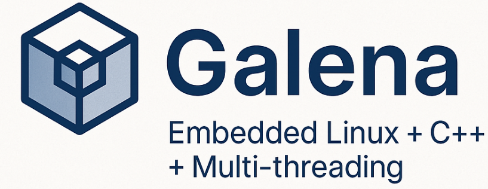

# Galena-Project
Galena is an embedded Linux project designed to explore inter-process communication (IPC) and multithreaded C++ programming on ARM64-based systems.
It simulates a modular embedded application where distinct processes collaborate to acquire, process, and display physiological data in real time.

## Overview
Galena consists of two cooperating processes that communicate through a UNIX pipe:

1. sensor:
* Interfaces with the MAX30102 pulse oximeter & heart-rate sensor via I²C.
* Runs two threads:
  * Sensor Thread: Periodically reads raw data from the MAX30102.
  * Processing Thread: Calculates BPM (beats per minute) and updates a pipe for IPC.

2. display:
* Receives BPM data from the pipe.
* Drives an SSD1306 OLED display (I²C) to show the current heart rate.
* Acts as the consumer process in the communication chain.

## Features
1. Multithreaded sensor management using std::thread.
2. Process-level communication via UNIX pipes.
3. Hardware-level I²C communication for both sensor and display.
4. Modular design for future scalability (e.g., additional sensors or wireless comms).
5. Designed for ARM64 embedded Linux systems (e.g., Milk-V Duo, Raspberry Pi).